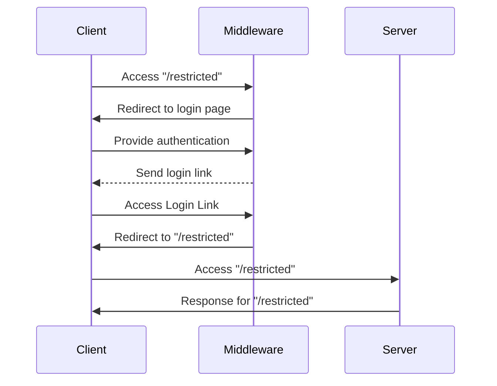

# Token Auth Middleware

This package provides a generic HTTP handler that can be used as middleware for
various Javascript based web servers. It does not rely on specific runtime
libraries like `crypto` and has been tested in Node and Deno environments.

The concept works as follows: The middleware has to be installed on a given
path, and will restrict access to it. Upon access, users will be prompted to
authenticate, using a third party message delivery (like e-mail). There they
receive a login link, which will grant them access to the resource.



## Usage

Create a Netlify edge and create an instance of an encoder, backend, and handler
(see more under "Extensibility"). The

```typescript
import {
  JwtEncoder,
  TestEmailBackend,
  TokenAuthHandler,
} from '@amazeelabs/token-auth-middleware';
import type { Context } from '@netlify/edge-functions';

const encoder = new JwtEncoder('shhhh, its a secret');
const backend = new TestEmailBackend({
  '*@amazeelabs.com': '*',
});

const handler = new TokenAuthHandler(encoder, backend);

export default async (request: Request, context: Context) => {
  return handler.handle(request, context.next);
};
```

By default, the middleware does not need any deeper integration. It works purely
on HTTP.
